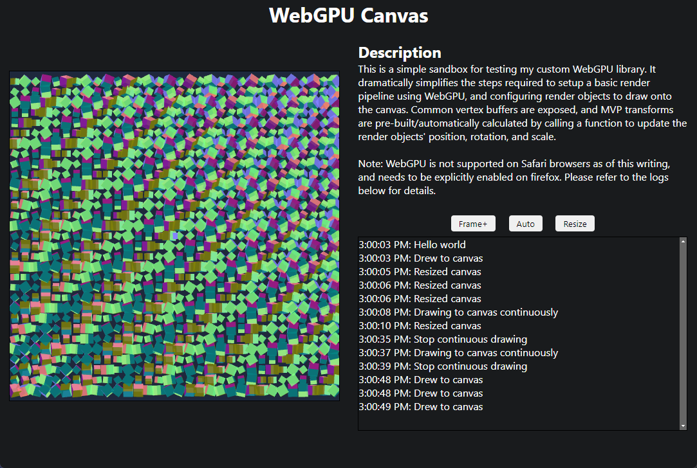

# WebGPU on Vite

Custom renderer object implementation for simplifying working with WebGPU.

- Implements support for multiple render objects 
- Implements support for reusing pipelines
- Implements support for canvas resizing
- Implements support for alpha channel transparency
- Implements multi-sampled anti-aliasing (4x)
- Implements mvp transforms for vertex shader
- Implements uv buffer for VBO
- Implements normal buffer for VBO

### Acknowledgements

Copied some matrix functions from [wgpu-matrix](https://github.com/greggman/wgpu-matrix) to reduce dependencies